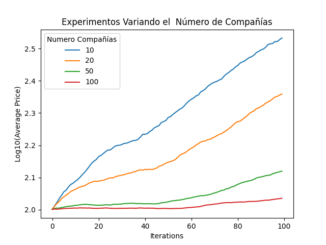
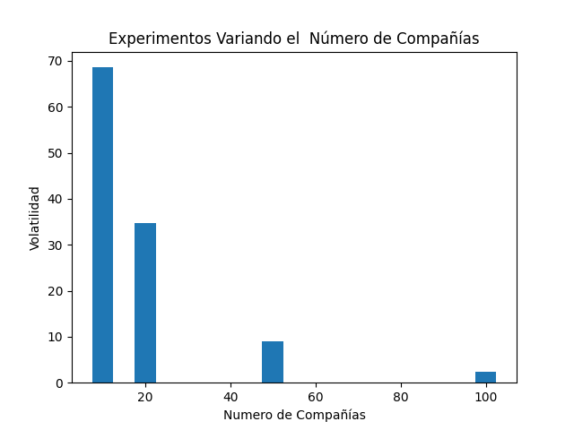

## Análisis
Conforme se incrementa la cantidad de compañías, mientras se mantienen los demás valores, se tiene que los diferentes usuarios (a ser poquitos) tienen una mayor variedad de compañías en donde invertir, esto hace que el dinero se distribuya más sobre las compañía por ser seleccionadas casi de forma aleatoria. Esto hace que las compañías no crezcan o acumulen capital pues todas las compañías, para los usuarios, lucen iguales e invierten de igual manera, esto se muestra a ver la gráfica de volatilidad que decrece conforme crece el número de compañías.

